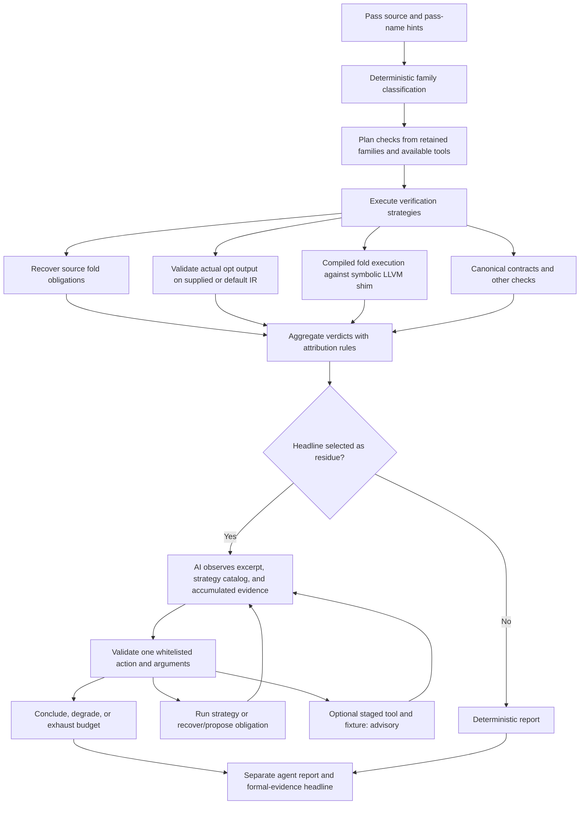

# Verification with an AI agent: process model and gap review

Reviewed 2026-09-08 against checkout `229b9ea`. This is a design and implementation review,
not a claim that the full test suite passed. No verifier behavior was changed.

O2T has an effective division of work: deterministic tools construct and discharge obligations;
the agent chooses investigations and proposes artifacts. However, a proof is only useful if it
is connected to the actual pass, states its coverage, and preserves the assumptions under which
it was obtained. Several current agent paths do not enforce that complete chain.

## Current process



The implemented residue set is `unclassified`, `advisory`, `skipped`, `error`, `refuted`,
and `planned`. A `refuted` entry enters diagnosis mode. `proved` entries are not selected.
The source excerpt is the first 6,000 characters. Registered tools can inspect the actual file,
but the agent has no general source-range retrieval action.

The deterministic headline is preserved. The agent headline combines deterministic checks and
agent formal checks; advisory conclusions and staged-tool outputs have no verdict weight.
Calls and steps are bounded, and repeated identical observations eventually degrade the run.

These are different verification scopes:

| Route | What its evidence can establish | Boundary |
| --- | --- | --- |
| Source recovery | A recovered rewrite refines its input under recovered guards | Recovery must represent the source faithfully; unmined folds remain outside the result |
| Compiled fold execution | Refinement on explored rewriting paths of compiled fold code | Input shape, path exploration, LLVM shim and analysis-query contracts bound the claim |
| Translation validation | The actual pass output refines a particular input IR function | All modeled runtime inputs to that function, not all possible input programs to the pass |
| Loop verification | Supported recurrence/transition obligations for all trip counts | Requires the supported loop structure and sound extraction |
| Canonical contract | A fixed transformation theorem | Does not establish that a vendor pass implements it |
| AI proposal | A theorem about the proposed model | Does not establish that the actual pass contains that model |

Code anchors: [agent loop](../o2t/agent/loop.py), [actions](../o2t/agent/actions.py),
[agent aggregation](../o2t/agent/report.py), [attribution](../o2t/orchestrate/attribution.py),
[orchestrator aggregation](../tools/cv-orchestrate.py),
[compiled-pass scope](symexec_real_pass.md).

## Required evidence model

Track each obligation independently, with a record linking:

`source/build identity -> source span or before/after IR -> guards and semantic model -> query -> verdict -> cross-checks -> coverage`

An agent action may add evidence, a candidate, or an investigation. It should not itself promote
a candidate to an attributed fact. Promotion requires an explicit binding to the target and the
appropriate recovery/semantic checks.

Use separate dimensions rather than one pass-level `proved` label:

- **Result:** proved, refuted, unknown, error.
- **Scope:** proposal, source fold, explored paths, function transform, corpus, or complete declared domain.
- **Binding:** unbound, source-bound, or bound to a recorded pass execution.
- **Assurance:** formal under registered semantics, experimentally checked semantics, independent confirmation state.
- **Coverage:** discovered, attempted, changed, proved, declined, timed out, vacuous, and not examined.

“Proved on these obligations with these assumptions” is a valid result. Exhaustive pass correctness
requires coverage of every transformation in a declared domain and an argument that discovery was
complete; a high corpus success percentage does not supply that argument.

## Prioritized gaps

| Priority | Finding and evidence | Consequence | Proposed correction and acceptance criterion |
| --- | --- | --- | --- |
| P0 | **AI proposals are not bound to the target.** `recover-fold` accepts replacement source text; proposal handlers prove supplied data without checking it against the file. Their action names are absent from `STRATEGIES`, and unknown strategy names are attributable by default. Reproduced below. | A correct theorem about invented code can become a `proved` headline for unrelated code. An invented unsound proposal can also become a pass refutation. | Keep proposals unbound until an extractor validates a source span, guards, operand binding and rewrite, or an actual pass run supplies matching IR. Both positive and negative unbound results must remain proposal findings. An unrelated proved/refuted proposal must never change pass status or trip a pass-refutation gate. |
| P0 | **Cross-check results are recorded but do not gate promotion.** `_h_recover_fold` and `_h_propose_fold_obligation` copy `rec['z3']` into the formal verdict even if `agree` is false. Grounding is optional and its result only enters the observation. | A detected recovery disagreement can coexist with a positive agent headline. This follows from code inspection; no natural disagreement was reproduced in this review. | Require successful mandatory checks before promotion; retain disagreement as an error or explicit untrusted result. Inject failed reconciliation/grounding and assert that no positive pass evidence is emitted. Grounding the AI's own rewrite still does not solve target binding. |
| P0 | **Secondary refutations can disappear from the headline and agent queue.** Deterministic aggregation considers primary-family negatives, but secondary positives may upgrade the headline. `select_residue` then excludes `proved`. Reproduced with a synthetic report below. | A stored counterexample can receive no AI investigation and escape headline-based failure gates. The stricter raw-check gate is available separately. | Surface any attributable negative as a refutation or explicit conflict needing investigation, regardless of primary family. Preserve unbound negatives as findings without accusing the target. The mixed-family case must enter the queue. |
| P0 | **Sampled instruction semantics can become proof assumptions.** The separate enrichment agent installs handlers after 13 default execution samples; later TV counts use those handlers. A wrong model passing those samples was reproduced below. | A solver can prove refinement relative to an incorrect semantics model. Sampling is useful evidence, not universal semantic validation. | Taint dependent results as conditional/experimental. Promote semantics only with a suitable semantic-equivalence argument, including width and poison/UB behavior; require independent transform validation for candidate use. The wrong-at-42 model must not yield an unqualified proof. |
| P1 | **Headline-level residue loses obligation-level gaps.** Aggregation accepts any attributable positive; it does not require complete source discovery or every sibling obligation to be decided. Some individual strategies do conservatively return inconclusive on declines, but this is not a uniform report contract. | The agent can stop after proving a small recovered fragment while other folds were never examined. | Select remaining obligations and uncovered source regions even when another obligation proved. Test a pass with one proved fold and an unmined or unsupported sibling. |
| P1 | **The agent front door cannot supply the plugin/corpus inputs.** `o2t/agent/cli.py` has no `--pass-plugin` or `--pass-corpus` options or forwarding, although the deterministic orchestrator supports them. | The agent cannot directly configure the strongest route for a built third-party pass. | Thread plugin, corpus, pass pipeline and build identity through CLI, context and reports. Exercise a real plugin that changes IR and a zero-change control through `cv-agent`. |
| P1 | **The two AI loops are separate.** The action registry has no enrichment action; `enrich_agent.run` diagnoses through scalar InstCombine TV and installs handlers only for its rerun. | Batch triage cannot turn a vocabulary decline into an evaluated enrichment and continue the same evidence chain. | Connect them through typed candidate artifacts after fixing the assurance boundary. Preserve candidate-dependent status and evaluate against the actual target, not only InstCombine. |
| P1 | **There is no corpus-generation feedback action.** The registry can classify, mine, prove, propose and stage, but cannot directly generate a trigger corpus and rerun the plugin. | The agent cannot systematically address “the pass did not fire” or uncover unexercised transformation paths. | Add bounded generation/mutation/minimization actions tied to uncovered folds, followed by real pass execution and TV. Measure newly exercised transformations separately from newly proved functions. |
| P2 | **Source visibility and routing signals are incomplete.** Prompt truncation is positional; `would_recover` is wired to only some miners. | Important code beyond the excerpt and unmeasured strategy opportunities may go unexplored. | Add function/span retrieval and structured decline evidence. Rank by actual recoverable obligations, while keeping absent measurements distinct from zero. |
| P2 | **Resume does not fingerprint the verification environment.** `previously_concluded` checks source hash and pass key, not solver, verifier, corpus, plugin or semantic-model versions. | Old agent formal checks can be reused after their assumptions or tools change. | Fingerprint all evidence dependencies; changing any relevant dependency must invalidate reuse. |
| P2 | **Budgeting is not end-to-end.** The initial orchestrator subprocess has no timeout; `run-strategy` does not pass the agent action timeout through to `execute_check`. Some downstream calls have their own limits. | LLM call caps do not bound total verification wall time; early entries can consume the global budget. | Use a shared deadline and per-obligation scheduling, with resumable cancellation and explicit reasons for unattempted entries. |

P0 means a priority for evidence integrity or interpretation, not a demonstrated vulnerability in
Z3. These findings concern how correctly scoped evidence is constructed, promoted and presented.

## Small reproductions performed

### 1. A correct proposal about unrelated code

Called `_h_propose_fold_obligation` with an `AgentState` whose source text was only
`// No rewrite exists here.`, pass name `unrelated-pass`, and these action arguments:

```json
{
  "predicate_source": "match(&I, m_Add(m_Value(X), m_Zero()))",
  "rewrite_source": "return replaceInstUsesWith(I, X);"
}
```

With the installed Z3 and no clang context, recovery succeeded, Z3 returned `proved`, and the
concrete reconciliation agreed over 256 inputs. Passing the resulting formal check to
`agent_headline` returned `status: proved`, with no unattributed checks. This exercised the real
handler and prover; it did not invoke a live model. The arithmetic proof was valid. Its attribution
to `unrelated-pass` was not established.

### 2. Secondary-family negative evidence

Passed a synthetic report to the real `_headline_for_pass` with primary family `peephole`,
`symexec-fold-cascade: proved`, and `slp-source: refuted`. The headline was `proved` and
`select_residue` returned no entry. This verifies the aggregation/queue behavior, not the existence
of a particular real pass with that combination.

### 3. An incorrect enrichment that passes the acceptance samples

Used the repository's `BSWAP` proposal, changing only its SMT builder to:

```python
lambda w, a: (
    f"(ite (= {a} (_ bv42 {w})) (_ bv0 {w}) "
    f"{enrich._bswap_smt(w, a)})"
)
```

`validate_proposal` with the installed Z3 and LLVM `lli` returned:

```json
{
  "default_battery": {"valid": true, "checked": 13, "disagreements": []},
  "held_out_input_42": {
    "valid": false,
    "checked": 1,
    "disagreements": [{"input": 42, "lli": 704643072, "smt": 0}]
  }
}
```

This demonstrates an acceptance-boundary gap, not a reproduced downstream false TV proof.
Adding 42 to the battery would catch this example but would not solve the general issue.

## Suggested implementation order and evaluation

1. Introduce explicit obligation binding and assurance metadata; stop promoting unbound proposals
   and failed cross-checks. Pin both positive and negative cases with focused fixtures.
2. Aggregate conflicts and coverage at obligation level; preserve mixed-family negatives and
   keep uncovered work in the agent queue.
3. Wire plugin/corpus inputs into the agent, then add targeted corpus generation and source retrieval.
4. Integrate enrichment only with conditional-result tracking and a separate semantics-promotion gate.
5. Harden resume/deadlines, then evaluate a live agent against deterministic routing on the same
   pinned pass set, tools, corpus and resource budget.

Measure incremental attributable obligations decided, newly exercised transforms, independently
confirmed counterexamples, unresolved coverage, false claims, repeat actions and cost. Compare
against a cheap all-miners routing baseline: the current `would_recover` signal may settle some
routing decisions without an LLM. Include classifiable-but-partially-covered passes, unclassified
passes, verifier errors and timeouts, missing prerequisites, mixed-family conflicts, and genuine
no-transform cases. Stub fixtures test the control contract; live runs test decision quality.

The July maturity document's statement that the agent had never run live is stale: current
`docs/agent.md` and `loop.py` describe observed live routing and repetition failures. Those
observations are useful, but are not a representative quantitative agent evaluation.
