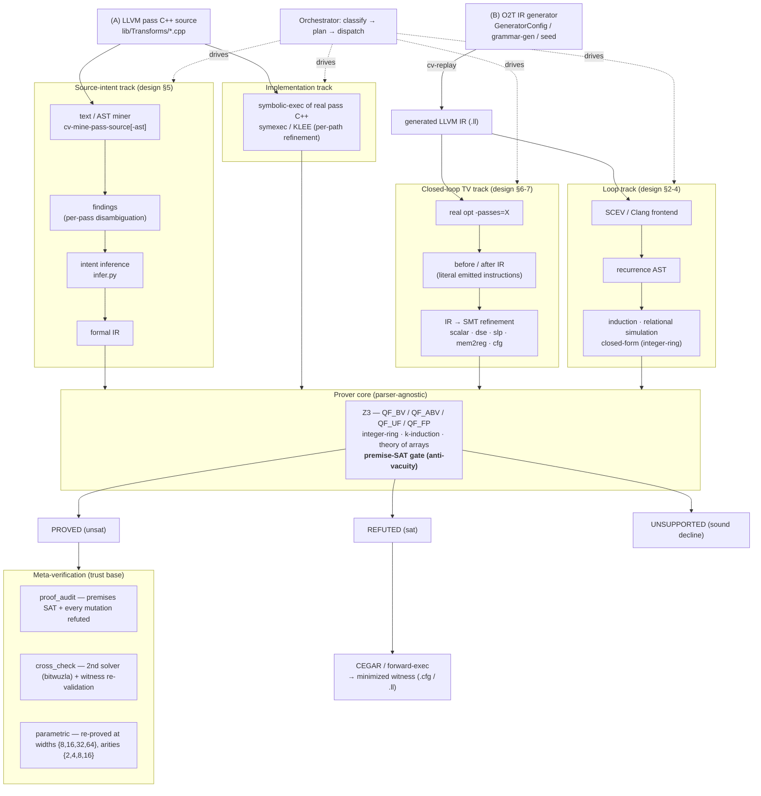

# O2T Verification Flow

How an obligation travels from an input (a real LLVM pass, or generated IR) through a frontend, into
the parser-agnostic prover, out to a verdict, and — for every `proved` — through the
meta-verification trust base. This is the paper's Figure 2 (pipeline: source/IR → frontend →
recurrence/SMT → prover → {proved | witness}).

## The three verdicts

- **PROVED** (`unsat`) — the obligation holds for all inputs. Only trusted after the premise-SAT
  gate (premises are jointly satisfiable, so the proof is not vacuous), and then re-certified by the
  meta-verification layer.
- **REFUTED** (`sat`) — a counterexample exists; forward-execution / CEGAR minimizes it to a concrete
  witness (`.cfg` / `.ll`) that reproduces the miscompile.
- **UNSUPPORTED** — the shape is outside the modeled fragment; declined explicitly rather than
  falsely proved (the sound boundary — "no silent caps").

## Where each track is gated

See [claim-fixture-map.md](claim-fixture-map.md) for the fixture that gates every box:
source-intent → `extract_*_model` / `intent_inference_*`; implementation → `symexec_real_pass` /
`klee_symexec`; closed-loop TV → `scalar_ir` / `dse_ir` / `slp_ir` / `mem2reg_ir` / `cfg_shape`;
loop → `loop_induction` / `loop_simulation` / `closed_form`; meta → `proof_audit` / `cross_check` /
`parametric` / `formal_ir_vacuous_premises`.
